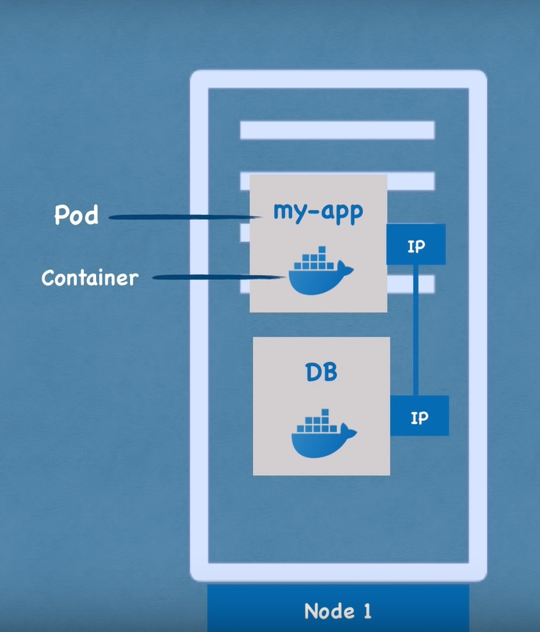
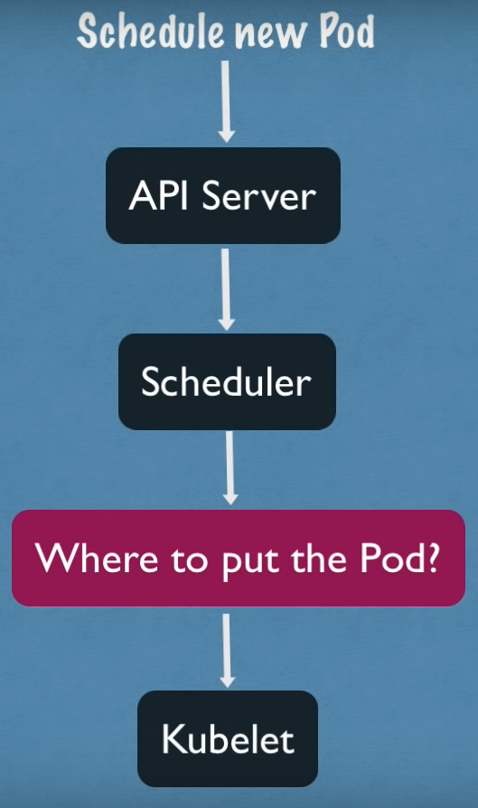
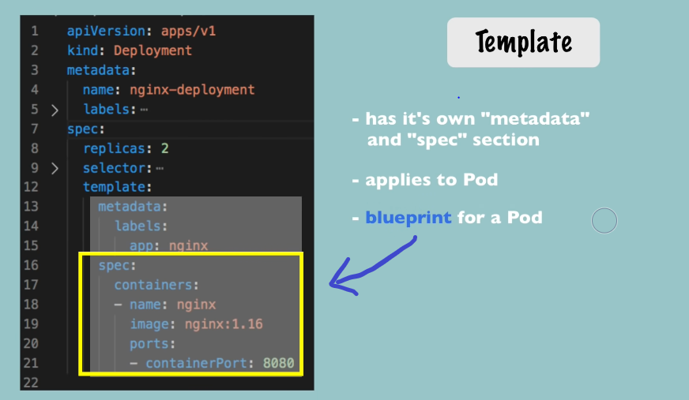

<!-- Kubernetes Guidelines -->

# Kubernetes

#### [Beginnners Guideline]

## Briefly About Kubernetes

### Official Definition
Open source **container orchestration framework** which was developed by **Google**.

* Basically what it does are managing containers which can be **docker containers** or other types technology.

* It helps managing applications that are made up of hundreds/thousands of containers in different deployment environments *such example* __physical, virtual, cloud or hybrid__.

### The need for containers

* Containers usually used as a host for small independent application *like* __microservices__.

### Feature do  orchestration tools offer

* No downtime. *it's always accessible by users* 

* High performance. *it loads fast & high response rates from the application* 

* Disaster recovery. *There will be some kind of mechanism to back up the data & restore it to the letest state*

___

## Most Used Kubernetes Components

1. Node

    * A simple server, a physical or virtual machine.

    * Also known as *Worker server*.

    * Each Node has multiple Pods on it.

2. Pod    

    * Smallest unit of Kubernetes, it is an abstraction over a container. 
    
    * It creates running environment.
    
    * we only interact with the Kubernetes layer.

    * Application Pod which is our own application that maybe will use a database pod with its own container.

    * **Important** : Pod usually for running one application container inside of it. However, you can run multiple containers inside on pod only if you have one main application container with a helper container or some side service that has to run inside of the pod.

    * 

    #### How does Pod communicate with each other in Kubernetes?

    * ##### In Kubernetes, each pod gets its own  internal ip address in a virtual network.

    * ##### The application container can communicate with the  using the ip address

    * ##### Pod components are ephemeral ( easily die / crash). A new one will created in its place & new ip address on re-creation.

3. Service 

    * Service gives a static ip address or permanent ip address that can attached to each pod that allows them to communicate with each other.

    * The application  pod  & database pod will have their own service, respectively.

    * Service also act as a load balancer.

    * Lifecycle of Pod and Service **ARE NOT** connnected. Even *if the pod dies*, the service & its ip address will stay.

    * To make your application to be accessible through browser, you need to create an external service.

    * **External Service** is a service that opens the communication from external sources. To avoid your database to be open to the public requests, you need to create an internal service. 

    * **Internal Service** is a type of a service that you specify when creating one. (ClusterIP)
    
    * ***URL of the external service*** is usually an http protocol with a ip address and a port number of the service. It is not practical & very bad for end product but good for testing purposes or if you want test something very fast.

    *  To check the IP address & extra information of the pods, use the command below.

    * ```bash
        kubectl get pod -o wide
      ``` 

    ## Kubernetes Services

    ### Types of Service :-

    * #### ClusterIp Services (Default type)
    
    * #### Headless Services

    * #### NodePort Services 

    * #### LoadBalancer Services


4. Ingress

    * The request will goes to ingress first then does forwarding then to the service.

    * It is used to route traffic into the cluster.

    * To make the external service URL look like with a secure protocol &  domain name.

5. ConfigMap

    * It is for your external configuration of your application that contain the configuration data like the database URLs.

    * **ALERT!!! :** 
    ***DO NOT PUT YOUR CREDENTIALS INTO THE ConfigMap!*** 

6. Secret

    * Secret is like the ConfigMap but it used to store secret data *example: credentials*. 

    * It store tha data in base64 encoded format. 

    * **Remember that the built-in security mechanism is not enabled by default!**

    * You can use the data from ConfigMap or Secret inside of your applications pod as environmental variables or as properties file.

7. Volumes

    * To keep the database data or log data to be persisted reliably long term.


    * **How it works?** It basically attaches a physical storage on a hard drive to your pod &  either store on local machine, means on the same server node where the pod is runnning or store on a remote storage, means outside the Kubernetes cluster *example : cloud storage*.

    * Using the external reference on the storage, your data will be there persisted when the database pod or container gets restarted.

    * Kubernetes cluster does **NOT** manage data persistence!!! Therefore, users are **RESPONSIBLE** for backing up, replicate & manage the data.

##### Imagine this situation happens, example :

#####  User access the application through the browser and a downtime happen because of the pod die, crash or it restarted. So to solve this problem, we will need replicate everything on multiple servers. So we will have another node where the replica or clone of the application would be run, which will be also connnected to the same Service.Therefore in order to do this, Kubernetes components below will be needed. 


8. Deployment  

    * **To replicate the pod**, you need to define blueprints for pods & specify how many replicas of pods that you would like to run.

    * Deployment is the blueprint. 

    * Instead of creating pod, you will create deployments. So that you can specify how many replicas of pods.

    * Deployment is another abstraction on top of pods.

    * It is convenient to interact with pods & replicate them.

    * *Let say* when the replica of the application pod dies, the service will forward the requests to another pod. So that, the application would be still be accessible for the user.  

    * ***Database pod can't be replicated via Deployment!***. This is because the database has a state which is its data.

    * Deployment is **ONLY** for stateless applications. 


9. Stateful Set

    * Basically have the same function with deployment.
    
    * This components is specify for **STATEFUL applications** or ***database like Elastic, MongoDB, MYSQL***.

    * It makes sure the database reads & writes synchronized, so there will be no data inconsistency.

    * **Take note!** deploying database application using stateful set is not easy.
    
    
    * **Common practice :** Database application are often hosted outside of the Kubernetes cluster. 

    * Stateful application is more difficult because :-
    
        * It can't be created & deleted at the same time in any order.

        * It can't be randomly addressed because the replica pods are not identical. They each have their own identity.

        * It maintain a sticky identity for each pods.
        
        * The pod is created from the same specification but not interchangeable whereby each has persistent identifier across any rescheduling.

    * Stateful application is not perfect for containerized environments.

___

##  Kubernetes Architecture


### Node Processes

* 3 processes must be installed on every Node that are used schedule & manage the pods.

* Nodes are the cluster servers that actually do the work, that's why it sometimes called as worker nodes.

#### First process : Container runtime

* A container runtime needs to be installed on every node.

#### Second process : Kubelet

* Process that actually schedules those pods is **Kubelet**, it is containers underneath.

* Kubelet is a process of Kubernetes itself that has interface with both container runtime & the node.

* Kubelet service is responsible to configure & starts the pod with a container inside. Then, it assigning resource from the node to the container *such CPU, RAM, & storage*. 

* Using services to communicate with each Node.

* Services catches the request directed to the pod or the application such as *database* & then forwards it to the respective pod.


#### Third process : Kube Proxy

* Kube proxy is responsible for forwarding requests from the service to pods.

* Also must be installed on every node.

* Kube proxy has intelligent forwarding logic inside that makes sure that the communication also works in a performant way with low overhead.


### How do you interact with Kubernetes cluster?

* Nodes that Kubernetes operates which are ***Master*** & ***Slave***.

#### Master processes

* There are 4 processes that run on every Master servers or  master nodes.

* It control the cluster state & the worker nodes.

* API Server (master process)

    * To deploy a new application ina kubernetes cluster, you will interact with API server using some client  *such as* UI like Kubernetes dashboard, command line tool like Kubelet, Kubernetes API. 

    * Act as cluster gateway to get initial request of any updates into the cluster or the queries from the cluster.

    * Act as gatekeeper for authentication to make sure that **only** authenticated & authorized get through to the cluster.

    * The only entrypoint into the cluster.

    * Is load balanced

* Scheduler (master process)

    * Scheduler just decides on which node new pod will be scheduled, the process that actually does the scheduling that starts the pod is the Kubelet

    * 

* Controller manager (master process)

    * It detects cluster state changes *like* crashing pods.

    * It will tries to recover the cluster state as soon as possible.

    *  It make a request for the scheduler to reschedule those dead pods 
    
    * The same cycle happens here where the scheduler decides based on the resource calculation  which worker nodes should restart those pod again.

    * It makes requests to the corresponding Kubelet on those worker nodes to actually restart the pods.


* etcd (master process)   

    * A key value store of a cluster state.

    * Also known as ***cluster brain***.

    * When a new pod gets scheduled when a pod dies, all of these changes get saved or updated  in the key value store of etcd.

    * This mechanism with scheduler, controller manager & etc works because of it data *(reason why etcd is the cluster brain)*

    * Etcd holds the **current status** of any component.

    * Things that are store in the etcd, *refer to the table below*.

    | What is Stored                                  | What is not stored   |
    | ----------------------------------------------- | -------------------- |
    | Cluster health                                  | Application data     |
    | Resource that are available on each worker node |                      |
    | Cluster state change                            |                      |
    | Application deployment state                    |                      |  

    * etcd store forms a distributed storage across all master nodes.  

* Kubernetes cluster is usually made up of multiple masters where each masternode run its master processes.  

* Example cluster setup

    * 2 master nodes & 3 worker nodes.

    *  *Take notes!* the hardware resources of master & node server is different.

    * The master processes are more important but they actually ***less*** load of work, so they ***need less*** resources such as CPU,RAM & storage.

    * The worker node do the actual job of running those pods with container inside. So, they ***need more*** resources.

    * To add new Master/ Node server

        1. Get a new bare server

        2. Install all the , master  & worker node processes

        3. Add it to the Kubernetes cluster.

___

## Minikube & Kubectl - Local Setup

#### **Minikube** 

* Main function : for testing purposes.

* one node cluster where the master processes the worker processes both run on one node. 

* This node will have a docker container runtime pre-installed. So that you can run the container or the pods with container on this node.

* The way it's going to run :

    * Through *virtual box* or other hypervisor created on the laptop.

    * Node that runs in that Virtual Box

#### **Kubectl**

* Command line tools for Kubernetes cluster

* Main function : to interact with any type of Kubernetes cluster setup.

* Not only available for Minikube cluster, also for Cloud cluster or hybrid cluster. 


### **Installation & create minikube cluster**

 * ***Take note!*** Minikube need **virtualization**

    * Install Hypervisor , *example Virtual box*

* For full installation guideline refer to this [link](https://minikube.sigs.k8s.io/docs/start/) & [here](https://kubernetes.io/docs/tasks/tools/) to install Kubernetes, available for all OS.   

## Main Kubectl Commands - Kubernetes CLI  


1. To get the status of the n odes 

    ```bash
        kubectl get nodes
    ```

2. To check the pods

    ```bash
        kubectl get pod
    ```

3. To check the services

    ```bash
        kubectl get services
    ```

4. To create a Kubernetes components

    ##### **-h** will shows list of available commands

    ```bash
        kubectl create -h
    ```

5.  To create deployment

    ##### **NAME** : put name that you want to assign to the deployment.
    
    ##### **Example** : creating nginx deployment.

    ##### To **make sure to download latest image** that you are using, example below: nginx as image. 

    ```bash
        kubectl create deployment NAME --image=image [--dry-run] [options]
    ```

    ```bash
        kubectl create deployment nginx-depl --image=nginx 
    ```
6. To get list of deployment

   ##### 

    ```bash
        kubectl get deployment
    ```

7. To get list of pods

   ##### if the **STATUS** shows *ContainerCreating* means the container is not ready yet.

    ```bash
        kubectl get pod
    ```

8. To get list of replicaset

   ##### 
 
    ```bash
        kubectl get replicaset
    ```

9. To edit deployment

   ### ***Everything BELOW Deployment should be managed automatically by Kubernetes.***
   
   ##### When entering this command, you will get auto-generated configuration file with default values.

    ```bash
        kubectl edit deployment NAME
    ```

10. To get list of deployment

    ```bash
        kubectl get deployment
    ```

11. Log to console

    ##### It shows what application is running inside the pod, in the form of log.

    ```bash
        kubectl logs POD_NAME
    ```

12. Get Interactive Terminal

    ##### To get addtional information of a pod.

    ##### Refer to *Message* column, the state change happend inside the pod

    ```bash
        kubectl describe pod POD_NAME
    ```

13. For debugging pods

    ##### To check what's going on inside the pod or when something is wrong.

    ##### What it does, it get to the terminal of that application container.

    ```bash
        kubectl exec -it POD_NAME --bin/bash
    ```
14. To delete pod

    ##### To delete pod, you have to delete deployment.

    ##### Same goes to other CRUD operations, all must happens on deployment level.

    ```bash
        kubectl delete deployment NAME
    ```
14. To execute/apply configuration file

    ##### To configure something in deployment or in a pod.

    ##### This command will execute the whatever is in the configuration file.

    ```bash
        kubectl apply -f FILE_NAME
    ```

    ```bash
        kubectl apply -f config-file.yaml
    ```
    ##### Above is the usual format used.


## K8s YAML Configuration File

* Every configuration file in Kubernetes has *3 parts*. 

    * Metadata
        
        * Example : name , labels

    * Specification

        * Example : replicas , selector , template 

    * Status

        * Automatically generated & added by Kubernetes.       

* The first 2 lines in the configuration file is declaring what you want to create here. *Example below*.

    * ```yaml
        apiVersion : apps/v1
        kind : Deployment
      ```  

    * ```yaml
        apiVersion : v1
        kind : Service
      ```  

* Attributes of *spec* are **specific** to the **kind**!

### Format of a configuration file

* **Format is in yaml.**

    * yaml is very strict indentation.

    * Best to store the config file with your code.

### **Blueprint for pods (Template)**

 

 

### **Connecting components (Labels & Selectors & Ports)**

* Metadata contain **label**, spec contain **selector**.

* In metadata, give any key-value pair for component.

* Pods get the parts created using the template blueprint.

* This label is matched by the selector to create the connection. So that, the deployment will know which pods belong to it.

* In the deployment has its own label that are use by the Service selector.

* In the spec of Service, selector need to be define which makes a connection between the Service & the deployment or it's pods. *This is because the Service must know which pods belong to that Service.*

*  The **containerPort** must match with the **targetPort**.

#### *How to validate the Service if it forwards the request to the right pods?*

#### *Answer: check IP address on the Endpoints by the entering command below.*

```bash
    kubectl get service SERVICE_NAME
```    

## Organize Your Components

### **Kubernetes Namespaces**

* What is a Namespace?

    * Place for organizing resources.

    * *Think it as a virtual cluster inside of Kubernetes cluster*.

    * Commands for Namespace

        * >kubernetes-dashboard

            * Specific to mini cube installation.

        * >kube-system 

            * It is not meant for your use.

            * Do **Not** create or modify in kube-system.

        * >kube-public

            * Contain publicly accessible data.

            * It has configmap.

        * >kube-node-lease   

            * Each nodes get its own object that contains the information about that node's availability.

        * >default   

            * Resources created are located.

    * How to create a Namespace?

        * By entering the command below.
        
        * ```bash
            kubectl create namespace NAMESPACE_NAME 
          ```

        * Second way to create namespace is with configuration file.              

* Why use Namespace?

    * To group resources in Namespace.

    * To avoid disrupting other team's deployment when working in the same Kubernetes cluster.

    * For resources sharing.
    
    * Easier for Blue/Green deployment.

    * To limit the resources & access to Namespace when working with multiple teams.

    * Ability to limit the resources that each namespace consumes.

* How Namespace work & how to use it?

    * Most resources from another Namespace cannot be access.

    * A resources that can be share across Namespace is Service.

    * Volume & node live globally in a cluster, it cannot be isolated. 

        * Using the command below to list components that not bound to a namespace.
        
        * ```
            kubectl api-resource --namespaced=false
          ```    
    * How to create components in Namespace?

        * Configure in the configuration file under the metadata.

        * To change the active Namespace, use the tool called **kubens**. Please refer [here](https://github.com/ahmetb/kubectx#installation) for installation.


## Kubernetes Ingress

* Ingress Controller

    *  It manage redirections & entrypoint to cluster.

    * Third-party implementations can be used such as Kubernetes Nginx Ingress Controller.

* Install Ingress Controller in Minikube

    * ```
        minikube addons enable ingress
      ```    

* Configuring TLS certificate

    * Define the attribute called *tls* under spec.

    * Under *tls*, define *secretName*

    * In the Secret configuration, using the type *secret-tls*

        * Data keys need to be *tls.crt* & *tls.key*

        * Values are file contents not the file paths/locations.

        * Secret component must be in the same Namespace as the Ingress component.


## Helm - Package Manager

*  ### What is Helm?

    * Helm Charts

        * Consist of bundle of YAML files.

        * You can use Helm to create your own Helm Charts & push them to Helm Repository.

        * You can also donwload & use the existing Helm Charts.

        * Features in Helm :-
        
            * Sharing Helm Charts

            * Templating Engine

            * Release Management
        
        * Helm Chart Structure

            *  
    

## Persisting Data in Kubernetes

* Storage Requirements

    1. Storage thata does not depend on the pod lifecycle.

    2. Storage must be available on all nodes.

    3. Storage needs to survive even if the cluster crashes.

### Persistent Volome

* Is created via yaml file, *PersistentVolume* as the kind. 

* ConfigMap & Secret is **NOT** created via PV & PVC.


### Persistent Volume Claim (PVC) 

* Application has to claim the Persistent Volume using PVC.

* PVC claim a volume with some storage size/capacity.

* Additional characteristics should be included such accessModes where it should be *ReadWriteOnce*, *ReadOnly* or *ReadWrite*.

* Must use the PVC that has been configure in the Pods configuration files.


### Storage Class (SC)

* Admin need to configure the storage for the cluster.

* Create Persistent Volumes whereby developers can claim them using PVCs.

* SC provisions PV **dynamically** when PVC claims it.

* SC is created via yaml configuration file. *StorageClass* as *kind*.

* StorageBackend is defined in the SC components using the *provisioner* attribute.

* Each storage backend has their own provisioner that Kubernetes offers :-

    * Internal provisioner (prefix) : *kubernetes.io*

    * Externally provisioner

* Parameters of the storage that we want to request for PV can be configure.     
 


